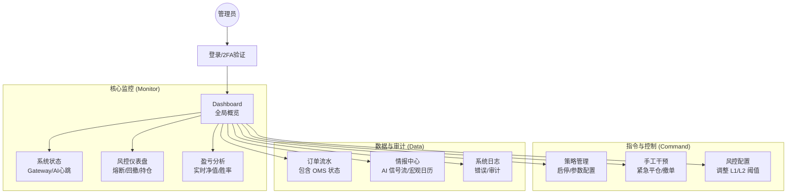

# Alpha-Trade 管理后台原型设计 (Admin UI Prototype)

**版本**: v1.0
**对应文档**: `DEVELOPMENT_MANUAL.md`, `RISK_PROTOCOL.md`
**定位**: 系统监控、风控配置与应急指挥中心。

---

## 1. 站点地图与导航结构 (Site Map)

采用侧边栏导航布局，将功能按“监控”、“控制”、“数据”分层。



---

## 2. 页面原型详情 (Wireframes)

### A. 核心仪表盘 (Dashboard) - "上帝视角"
**设计意图**：一屏展示所有致命风险指标，提供“一键刹车”能力。

```text
# [Alpha-Trade] Command Center        [🔴 紧急停机 (GLOBAL HALT)]  [👤 Admin]

-------------------------------------------------------------------------------
| 📊 核心指标 (Core Metrics)      |  📡 系统健康 (System Health)              |
-------------------------------------------------------------------------------
| 今日盈亏:   +$1,245.50 (+1.2%)  |  Spot Gateway:   🟢 正常 (23ms)           |
| 当前权益:   $105,400.00         |  Future Gateway: 🟢 正常 (45ms)           |
| 风险敞口:   32% (上限 80%)      |  AI Agent:       🟢 活跃 (心跳: 1s前)     |
| 日内回撤:   -0.5% (熔断 5.0%)   |  News Feed:      🟢 正常 (最新: 10s前)    |
-------------------------------------------------------------------------------

-------------------------------------------------------------------------------
| 🛡️ 活跃风控状态 (Active Risk Stats - L1/L2)                                 |
-------------------------------------------------------------------------------
| 连续亏损计数: [ 0 / 5 ]  (正常)                                              |
| 宏观冷却模式: [ ⚪ Inactive ] (下个窗口: FOMC, 2h 30m 后)                    |
| 杠杆限制状态: [ 🟢 Relaxed ] (允许最大 2x, 当前实际 1.2x)                     |
| 紧急操作:     [💀 Kill Switch (清仓)]   [🔄 Reset Daily Counters (重置计数)]  |
-------------------------------------------------------------------------------

-------------------------------------------------------------------------------
| 🤖 策略概览 (Active Strategies)                                              |
-------------------------------------------------------------------------------
| ID      | 策略名          | 标的    | 方向 | 状态  | 胜率(20) | 动作         |
|---------|-----------------|---------|------|-------|----------|--------------|
| ST-101  | MACD_Breakout   | BTCUSDT | Long | 🟢 Run | 65%      | [⏸ 暂停]    |
| ST-102  | Grid_Maker      | ETHUSDT | N/A  | 🔴 Stop| 40%      | [▶ 启动]    |
| ST-103  | AI_Sentiment    | SOLUSDT | Short| 🟡 Cool| 55%      | [查看原因]   |
-------------------------------------------------------------------------------
```

### B. 风控配置中心 (Risk Configuration) - "规则引擎"
**设计意图**：可视化 `RiskConfig` 结构体，允许动态调整，无需重启代码。

```text
# 风控参数配置 (L1/L2 Configuration)

## 🔴 L1: 系统级熔断 (System Hard Stops)
-----------------------------------------------------------------
[输入框] 最大日内回撤 (Max Daily Drawdown):    |  5.0  | %
[输入框] 最大连续亏损次数 (Max Consc. Loss):   |   5   | 次
[开关]   宏观新闻自动避险 (Macro Cooling):     |  ON   |
[输入框] API 错误率阈值 (API Error Tolrance):  |  20   | %/min
-----------------------------------------------------------------

## 🟠 L2: 账户级限制 (Account Hygiene)
-----------------------------------------------------------------
[输入框] 现金保留比例 (Min Cash Reserve):      |  5.0  | %
[输入框] 单标的持仓上限 (Max Single Pos):      |  30.0 | %
[输入框] 全局最大杠杆 (Max Leverage):          |  2.0  | x (Hard Limit)
[开关]   强制逐仓模式 (Force Isolated):        |  ON   | (不可关闭)
-----------------------------------------------------------------

## 🟡 L3: 订单执行保护 (Execution Guard)
-----------------------------------------------------------------
[输入框] 默认滑点保护 (Slippage Tolerance):    |  0.5  | %
[输入框] 盈亏比强制要求 (Min R/R Ratio):       |  1.5  | : 1
[输入框] 信号失效时间 (Signal TTL):            |  500  | ms
-----------------------------------------------------------------

[💾 保存并应用配置]  (需二次确认: 此操作将立即影响所有新订单)
```

### C. 市场情报与 AI 决策流 (Market & AI Intelligence)
**设计意图**：展示 AI 如何处理新闻及其 Confidence Score，对应 `DEVELOPMENT_MANUAL` 中的 1.4 节。

```text
# 市场情报流 (News & AI Stream)

---------------------------------------------------------------------------------------------
| 时间     | 来源       | 标题/摘要                          | AI 情绪 | 置信度 | 决策建议      |
|----------|------------|-----------------------------------|---------|--------|--------------|
| 10:42:05 | Twitter(X) | @ElonMusk posted a Doge image...  | 🚀 Bull | 0.95   | Long DOGE    |
| 10:41:10 | CoinDesk   | SEC delays ETF decision again...  | 🐻 Bear | 0.88   | Close Longs  |
| 10:40:00 | Binance    | System Maintenance in 10 mins...  | ⚠ Warn  | 1.00   | Cancel Orders|
---------------------------------------------------------------------------------------------

## AI Agent 状态详情
* **当前模式**: [🛡 Defensive] (只平不复)
* **原因**: 市场波动率 (ATR) 超过历史均值 200%。
* **最近一次心跳**: 10:42:15 (Lat: 150ms)
```

### D. 订单管理与审计 (OMS & Audit)
**设计意图**：展示订单全生命周期状态，特别是各种 ID 的追踪。

```text
# 订单详情 (Order Management)

搜索: [ ClientOrderID / Symbol ]

-----------------------------------------------------------------------------------------------
| 时间     | 标的    | 方向 | 类型 | 价格      | 数量  | 状态      | 备注/失败原因              |
|----------|---------|------|------|-----------|-------|-----------|---------------------------|
| 10:42:01 | BTCUSDT | Buy  | Lmt  | 98,500.00 | 0.1   | ✅ FILLED | 正常成交                   |
| 10:41:55 | ETHUSDT | Sell | Mkt  | 2,450.00  | 5.0   | ❌ REJECT | 风险拦截: 强平距离不足安全垫 |
| 10:41:00 | SOLUSDT | Buy  | Lmt  | 145.20    | 10.0  | ⏳ OPEN   | 等待成交                   |
-----------------------------------------------------------------------------------------------
```

---

## 3. 设计逻辑说明

1.  **分层风控可视化**: 
    *   在 Dashboard 显眼位置展示 **L1 级状态**（如连续亏损计数），因为这直接决定系统是否会突然停机。
    *   将 **L2/L3 配置** 单独归类，因为这些属于策略运行的边界条件，通常不需要频繁变动。

2.  **AI 透明化 (White-box AI)**:
    *   不仅展示 AI 的结果（买/卖），还展示 **置信度 (Confidence Score)** 和 **原始新闻源**。
    *   这符合 `RISK_PROTOCOL` 中 "AI 默认为建议模式" 的原则，让人类管理员可以随时核查 AI 的判断依据。

3.  **紧急操作原子化**:
    *   **Global Halt (全局停机)** 和 **Kill Switch (一键清仓)** 被设计为 Dashboard 上最显眼的按钮。
    *   这对应了文档中对于“死人开关”和“应急操作流程”的强制要求。

4.  **数据流向监控**:
    *   Dashboard 顶部的 "Gateway Latency" 监控，直接对应架构图中的 IO 瓶颈点，确保交易通道畅通。

