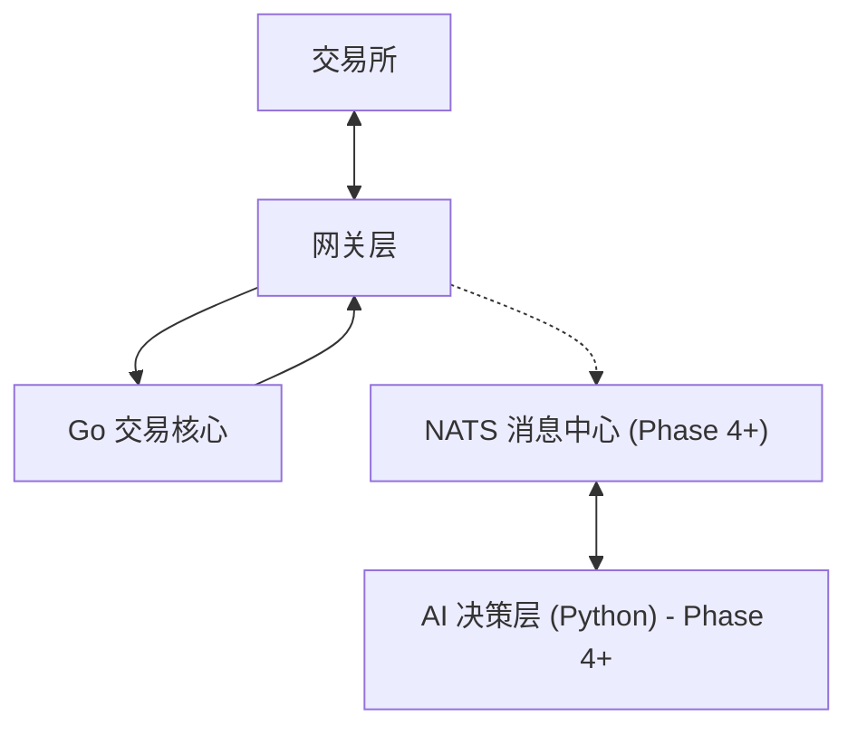

# Alpha-Trade 核心开发手册 (Core Development Manual)

**版本**: v1.1
**更新时间**: 2025-12-22
**定位**: 本文档是系统的**唯一架构真理来源**，涵盖架构设计、领域模型定义及工程规范。

---

## 1. 架构设计 (System Architecture)

系统采用 **模块化单体 (Modular Monolith)** 架构，并结合 **AI 决策侧边服务**（⚪ Phase 4+ 计划中）。

### 1.1 设计哲学：从《繁花》看量化系统 (Philosophy & Cultural DNA)

本项目的工程设计深受《繁花》中所展现的商战智慧启发，我们将复杂的量化交易拆解为四个维度的核心能力：

1.  **风控：爷叔的“逃生舱”逻辑 (Risk Management)**
    *   **核心思想**: “先要学会输，才能学会赢。”
    *   **映射实现**: 系统的 `RiskManager` 是“爷叔”。它不负责赚钱，只负责在系统亏损触及阈值时强制平仓、切断 Gateway 连接。在 601 战役般的市场巨震中，它是唯一的止损锚点。
2.  **微观：强总的“围猎”与流动性 (Microstructure)**
    *   **核心思想**: 识别人造的虚假盘口与订单流毒性。
    *   **映射实现**: 我们的 `Gateway` 必须具备 L2/L3 Orderbook 解析能力，通过 `Sequence ID` 追踪识别人为操纵（Spoofing）。在黄河路的商战中，信息差就是生死线。
3.  **鲁棒：阿宝的“夜东京”备份 (Resilience)**
    *   **核心思想**: 永远有后路，状态可恢复。
    *   **映射实现**: `internal/logic` 的状态必须持久化。即使系统重启，也能通过 `Idempotency`（幂等性）和 `State Recovery` 恢复。阿宝在饭店的备用金，就是我们数据库里的 `ClientOid` 记录。
4.  **架构：和平饭店的“派头” (Clean Architecture)**
    *   **核心思想**: 层次分明，互不干扰，腔调要足。
    *   **映射实现**: 坚持 `internal/domain` 纯净度（NO SDK imports）。无论对接 Binance 还是 OKX（不同的柜台），核心逻辑（和平饭店决策层）雷打不动。

### 1.2 核心分层与数据流

> 💡 **详细全链路驱动图已移至独立文件**: [docs/architecture_flow.md](./architecture_flow.md)
>  
> **Phase 3 约束**：当前核心链路为 Go 内部同步调用；NATS 与 AI 侧边服务为 Phase 4+ 计划，未进入执行路径。



### 1.2 目录结构 (Monorepo)

*   `/internal`: Go 核心代码（交易、风控、OMS）。
*   `/ai-agent`: Python AI 服务（基于 CrewAI 和 Gemini 3）⚪ **Phase 4+ 计划**（详见 `ai-agent/PAUSED.md`）。
*   `/docs`: 全局文档与协议。
*   `/pkg`: 公共工具库。

### 1.3 关键组件职责

1.  **Gateway (接入层) - 原子接口与限流控制**:
    *   **Spot Gateway**: 专职现货。
    *   **Future Gateway**: 专职合约。
    *   **价格保护实现 (Price Protection Implementation)**:
        *   **机制**: 严禁直接调用 `type=MARKET` 的原始市价单。
        *   **模式**: 统一封装为 `type=LIMIT` + `timeInForce=IOC`。
        *   **逻辑**: Gateway 接收逻辑层的 `ProtectPrice`，并将其作为 Limit 价格发送。利用交易所撮合引擎的 IOC 特性实现：高于保护价不成交、低于保护价即时成交的效果。
    *   **原子接口原则 (Atomic Interfaces)**:
        *   不进行底层自动降级。由上层逻辑明确决定调用 `PlaceOrderFast` (WS) 还是 `PlaceOrderReliable` (HTTPS)。
        *   所有接口调用必须返回精确的延迟指标与通道状态。
    *   **限流核心 (Rate Limiter Core)**:
        *   **算法选型**: 严格禁止令牌桶 (Token Bucket) 以规避交易所对突发流量 (Burst) 的 IP 封禁。强制使用 **滑动窗口 (Sliding Window)**。
        *   **多维度配额管理**: 同时监控“每秒请求数 (Req/s)”和“权重消耗 (Weight/min)”。
        *   **职责分离与真理校准**: 
            *   **Gateway 层**: 负责解析具体交易所的特定 Header 常量，并封装为标准化的 `RateLimitFeedback`。
            *   **Limiter 层**: 基于标准化数据进行决策与本地计数修正。
        *   **双通道共享**: WS 和 HTTPS 共享同一个限流器实例，确保全局合规。
        *   **等级保护**:
            *   < 80% 权重: 所有指令正常。
            *   80% - 95%: 拦截非核心查询，仅允许交易指令。
            *   > 95%: 拦截一切指令，仅允许**紧急平仓**。
    *   **News/Event Gateway (AI-Powered)**: 
        *   **多源新闻集成**: 鉴于 CryptoPanic 免费版延迟过高（24h），系统采用 **RSS 聚合 + 交易所 API + 专业媒体抓取** 的多源策略。
        *   **网页渲染与抓取 (Web Scraping)**:
            *   **方案 A: Jina Reader (当前采用)**: 通过 `r.jina.ai` 获取渲染后的 Markdown，轻量且 LLM 友好。
            *   **方案 B: 自建 V8 (Playwright) - 长期规划**: 部署 Headless 浏览器集群，用于处理极度复杂的交互逻辑（如模拟点击、反爬绕过）。
        *   **集成 Gemini 3**: 负责对抓取到的完整文本进行逻辑推演。
        *   **异步驱动架构 (MQ-Driven)**: 
            *   AI 分析结果通过 **消息队列 (MQ/EventBus)** 发送，实现 AI 层与交易层的彻底解耦。
            *   **实时反馈流**: `Multi-Source (Go GW)` -> `MQ (MARKET.NEWS)` -> `CrewAI (Multi-Agent Crew)` -> `MQ (AI.DECISION)` -> `RiskManager (Go)`.
        *   **控制指令集**:
            *   **全局熔断**: 当得分极低 (e.g., < -0.9) 时，自动通过 MQ 广播 `Global_Halt` 信号，停止所有标的新开仓。
            *   **方向导向 (Directional Bias)**: 根据得分控制策略的开仓方向（仅多、仅空或双向）。
            *   **杠杆动态限制**: 极高不确定性下，MQ 驱动风控模块强制将最高杠杆降至 1x。
2.  **Logic (逻辑层)**:
    *   **Strategy**: 纯计算，关注 K 线形态与信号生成。
    *   **Risk**: **分治策略**。
        *   `SpotRules`: 重点检查余额充足率、资产分散度。
        *   `FutureRules`: 重点检查 2x 杠杆限制、逐仓模式、强平距离。
    *   **PerformanceMonitor (绩效监控器)**:
        *   **职责**: 实时从 `Settlements` 表和内存事件流中聚合统计数据。
        *   **反馈回路**: 为 `Risk` 模块提供“胜率”和“期望值”快照，驱动 L1/L2 级的动态降级决策。
    *   **OMS**: 路由订单到对应的 Gateway，实现复杂的执行算法。

### 1.4 执行算法 (Execution Algorithms)

为了平衡成交质量与手续费成本，OMS 需支持以下执行模式：

1.  **Passive Limit (被动挂单)**: 仅以 Maker 身份挂单，若价格偏离则由策略决定是否撤单。
2.  **Limit-Chasing (限价追单)**:
    *   **逻辑**: 先以 Limit 挂单。
    *   **阈值**: 设定 `ExpireSeconds` (时间) 或 `PriceDeviation` (价格偏离)。
    *   **动作**: 触发阈值后，立即撤单并转为 **Market Order** 强制补齐剩余数量，应对流动性枯竭。
3.  **TWAP (时间加权平均)**: 大额订单在一段时间内均匀拆分执行，降低冲击成本。

### 1.5 交易方向规范 (Directionality)

| 市场类型 | 允许方向 | 说明 |
| :--- | :--- | :--- |
| **SPOT (现货)** | **LONG Only** | 仅支持 买入(Open) -> 卖出(Close)。 |
| **FUTURE (合约)** | **LONG & SHORT** | 支持做多与做空。 |

### 1.5.1 退出策略设计 (Exit Strategy Design)

系统采用**多层次退出机制**，区分止损、止盈和信号反转三种场景，确保超短线交易中能够快速响应市场异动。

#### 1.5.1.1 退出信号分类 (Exit Signal Types)

| 类型 | 触发场景 | 执行优先级 | 执行方式 |
| :--- | :--- | :--- | :--- |
| **Stop Loss** | 价格向不利方向快速移动 + 放量 | **Emergency** (最高) | 立即市价平仓 (IOC + 保护价) |
| **Take Profit** | 到达目标利润 + 出现反转信号 | **High** | 分批平仓 (50% 市价 + 50% 挂单) |
| **Reversal** | 极速下跌/上涨 + 方向一致 + 成交放量 | **Medium** | 根据置信度决定平仓比例 |

#### 1.5.1.2 极速反转检测器 (Fast Reversal Detector)

针对 **1s K线** 的超短线场景，系统实现专用的反转信号检测器，用于捕捉"极速下跌 + 方向明朗 + 成交放量"的平仓时机。

**核心检测逻辑**：
1. **方向一致性检测 (Direction Consistency)**
   - **窗口**: 最近 30 根 1s K线
   - **阈值**: 至少 **70% 方向一致** (21/30 根)
   - **目的**: 过滤震荡市，确保是单边快速移动

2. **幅度确认 (Magnitude Confirmation)**
   - **单根K线跌幅**: > 0.15% (根据标的波动率动态调整)
   - **动态阈值表**:

| 标的类型 | 跌幅阈值 | 成交量倍数 | 方向一致率 |
| :--- | :--- | :--- | :--- |
| **BTC/ETH** | 0.12% - 0.15% | 1.8x - 2.0x | 65% - 70% |
| **主流币** | 0.15% - 0.20% | 2.0x - 2.2x | 70% - 75% |
| **山寨币** | 0.25% - 0.35% | 2.5x - 3.0x | 75% - 80% |

3. **成交量放大验证 (Volume Surge)**
   - **计算**: 当前 Volume > 最近 30s 均量的 **2 倍**
   - **目的**: 确认是真实突破而非假信号

4. **震荡过滤器 (Consolidation Filter)**
   - **ATR 检测**: `ATR(30s) > 前 5 分钟 ATR 均值`
   - **目的**: 避免横盘震荡中的频繁误触发

#### 1.5.1.3 噪音过滤机制 (Noise Filtering)

1s K线的噪音极大，必须实施多层过滤：

**过滤层级**：
1. **L1 - 幅度阈值**: 过滤正常波动 (<0.15%)
2. **L2 - 方向一致性**: 过滤随机游走 (<70%)
3. **L3 - 成交量确认**: 过滤虚假突破 (<2x)
4. **L4 - ATR震荡过滤**: 过滤横盘震荡

**参数动态调整**：
- 所有阈值参数存储在 `strategy_configs` 表
- 支持按标的、时段、波动率环境进行热更新
- AI 决策层可通过 MQ 下发参数调整指令

#### 1.5.1.4 退出执行策略 (Exit Execution)

**分层执行逻辑**：

```go
// 伪代码示例
func ProcessExitSignal(signal *ExitSignal, position *Position) Decision {
    switch signal.Type {
    case ExitTypeStopLoss:
        // 止损：立即全部平仓，绕过所有限制
        return Decision{
            Action:     ActionClose,
            Ratio:      1.0,           // 100% 平仓
            Priority:   PriorityEmergency,
            OrderType:  OrderTypeIOC,  // 立即成交或取消
            Reason:     "Fast reversal stop loss",
        }
        
    case ExitTypeTakeProfit:
        // 止盈：分批平仓
        if signal.Confidence > 0.75 {
            return Decision{
                Action:    ActionClosePart,
                Ratio:     0.5,          // 先平 50%
                Priority:  PriorityHigh,
                OrderType: OrderTypeLimit,
                Reason:    "Take profit with reversal signal",
            }
        }
        
    case ExitTypeReversal:
        // 反转信号：根据置信度决定
        if signal.Confidence > 0.80 {
            return Decision{
                Action:    ActionClosePart,
                Ratio:     0.3,          // 平 30%
                Priority:  PriorityMedium,
                Reason:    "High confidence reversal",
            }
        }
    }
}
```

**执行通道优先级**：
- **Stop Loss**: 强制使用 WebSocket 快速通道 (Fallback to REST)
- **Take Profit**: 优先使用 REST API (更可靠)
- **Reversal**: 根据市场流动性选择通道

#### 1.5.1.5 风控集成 (Risk Integration)

退出信号通过独立的 **紧急通道** 发送至 Risk Manager：

1. **Stop Loss 信号**: 直接绕过日内交易次数限制
2. **Take Profit 信号**: 需检查是否会触发 Pattern Day Trader 规则
3. **Reversal 信号**: 正常风控流程，但优先级高于新开仓

**状态持久化**：
- 所有退出信号记录到 `exit_signals` 表
- 用于回测验证与参数优化
- 生成每日退出质量报告 (Exit Quality Report)

### 1.3 外部事件分类 (External Events)

... (表格保持不变) ...

### 1.4 新闻源集成与质量保障 ⚪ Phase 4+

为了确保 AI 决策层获取及时且真实的数据，系统采用多源交叉验证策略，弃用高延迟的单一聚合商。

> **当前状态**: 设计完成，代码未实现。当前 Phase 3 聚焦核心交易能力。

#### 1.4.1 核心来源评估

| 来源 | 实时性 | 成本 | 评估结论 |
| :--- | :--- | :--- | :--- |
| **CryptoPanic** | 🔴 24h 延迟 (免费) | $199/月 | **弃用**。免费版延迟过大，付费版限制过多，性价比极低。 |
| **RSS 自建聚合** | 🟢 实时 (<1min) | **0 元** | **主选**。直接订阅 CoinDesk, CoinTelegraph 等，无额度限制，性能极佳。 |
| **Binance API** | 🟢 实时 | 免费 | **必选**。专门监听公告、上币、维护等第一手交易所信号。 |
| **RSSHub (X/Twitter)** | 🟢 实时 (<1min) | **0 元** | **关键信号**。自建 RSSHub 监控马斯克等名人推特，捕获 Meme 币异动。 |
| **CryptoCompare** | 🟢 实时 | 免费/低配 | **备选**。聚合度高，适合作为长尾数据的补充。 |

#### 1.4.2 数据处理流 (Pipeline)
1.  **Go NewsGateway**: 并发轮询 (Polling) 多个 RSS 源（含 RSSHub 生成的推特流）及交易所公告 API。
2.  **内容清洗**: 提取 URL，初步匹配 `BTC`, `ETH` 等交易对关键字。
3.  **MQ 发送**: 将标准化消息推送到 `MARKET.NEWS`。消息包含 `url`，由 AI Agent 侧通过 `r.jina.ai` 获取正文。

#### 1.4.3 社交媒体异动监控 (High-Priority Social)
针对 Elon Musk, Vitalik Buterin 等对市场有重大影响力的账户，系统建立专用的“极速通道”：

*   **数据获取**: 使用 **RSSHub (私有化部署)** 将目标 X (Twitter) 账户转化为 RSS 流。
*   **分级处理**: 
    *   **一级账户**: (如 Musk) 触发时立即通过 AI 进行逻辑推演，不经过任何过滤器。
    *   **二级账户**: 需匹配 `Crypto`, `Binance`, `ETF` 等关键字后才激活 AI 分析。
*   **Gemini 3 角色**: 
    *   **隐喻分析**: 马斯克的推文通常含蓄，AI 需识别图片或文字背后的币种关联性（如识别“柴犬图”与 DOGE 的关联）。
    *   **反讽识别**: 过滤非交易相关的日常推文。

#### 1.4.4 宏观政策监控矩阵 (Macro Policy Constants)
系统将顶级政策源定义为底层常量，确保数据获取的路径为“最短直线”：

| 机构 | 数据类型 | 常量标识 / 接入地址 |
| :--- | :--- | :--- |
| **US White House** | RSS | `https://www.whitehouse.gov/briefing-room/feed/` |
| **US SEC (EDGAR)** | API | `https://www.sec.gov/edgar/sec-api-documentation` |
| **Federal Reserve** | API (FRED) | `https://api.stlouisfed.org/fred/` |
| **EU Central Bank** | RSS | `https://www.ecb.europa.eu/home/html/rss.en.html` |

*   **执行策略**: 
    *   **高优先级**: 以上来源触发的消息在 MQ 中标记为 `High Priority`，AI Agent 需中断常规任务优先处理。
    *   **关键词触发**: 针对宏观源，额外关注 `Interest Rate`, `Regulation`, `Crypto`, `Enforcement` 等核心词汇。

#### 1.4.5 假新闻与假账号预防
*   **来源权重**: 顶级媒体（如 Coindesk）权重为 1.0，推特/博客权重为 0.3。
*   **多源对比**: 重大事件若在 5 分钟内只有单一源报道，AI 需标记为 `Low Confidence`。
*   **域名白名单**: 严格限制 AI 爬取的域名范围。

#### 1.4.4 标准化消息格式 (JSON)
```json
{
    "id": "rss_1029384",
    "source": "CoinDesk",
    "title": "Bitcoin Surpasses $100k...",
    "text": "Snippet of the news...",
    "url": "https://www.coindesk.com/markets/...",
    "currencies": ["BTC"],
    "timestamp": 1703310000
}
```

### 1.6 可观测性架构 (Observability)

系统采用 **OpenTelemetry (OTEL)** 作为统一标准，解耦业务代码与具体的监控后端。

1.  **Tracing (Jaeger/Tempo)**: 
    *   **TraceID 穿透**: 通过 NATS Header 将 `TraceID` 从 Python AI 侧传递至 Go 核心侧。
    *   **分级采样策略 (Tiered Sampling)**: 
        *   **全量 Metrics**: 对所有行情 Tick 进行计数与延迟统计 (Prometheus)。
        *   **条件 Tracing**: 仅当策略生成信号、触发风控检查、订单执行或发生 Error 时，才开启全链路 Span 追踪。
    *   **采样率**: 生产环境建议设置概率采样（如仅追踪 0.1% 的非交易行情，100% 追踪交易信号）。
2.  **Metrics (Prometheus)**:
    *   **业务指标**: 实时账户净值 (Equity)、各标的持仓风险 (Exposure)、限流器权重消耗。
    *   **性能指标**: NATS 消息积压量、Go GC 延迟、网关请求 RTT。

### 1.7 硬件环境参考 (Hardware Requirements)

针对启动阶段，系统采用 **精简模式 (Lean Mode)** 部署：

| 配置项 | 推荐规格 | 说明 |
| :--- | :--- | :--- |
| **CPU** | 2 Core | 满足 Go 并发与 Python AI 逻辑处理。 |
| **内存** | 4 GB | **最低建议**。2GB 无法提供足够的安全冗余。 |
| **存储** | 40 GB+ | 优先选择 SSD。 |
| **监控** | 外部平台 | 减少本地 IO 压力，使用 Grafana Cloud 或云厂商免费额度。 |

**资源限制建议 (Docker Limit)**:
*   **Go Core**: 1024MB (GOMEMLIMIT=800MB)
*   **Python AI**: 1536MB
*   **PostgreSQL**: 512MB
*   **NATS**: 256MB

### 1.8 数据流驱动模式 (Event-Driven Patterns)

系统由两种核心事件流驱动，通过 **NATS** 实现物理隔离与逻辑协同：

1.  **极速行情流 (The Fast Path)**:
    *   **驱动源**: 交易所 WebSocket (Ticks/Candles)。
    *   **链路**: `Gateway` -> `NATS` -> `Strategy` -> `Risk` -> `OMS`。
    *   **特点**: 纳秒级响应，仅处理数值计算。

2.  **AI 智能偏见流 (The Smart Path)** ⚪ Phase 4+:
    *   **驱动源**: RSS/Twitter -> `NewsGateway`。
    *   **链路**: `NewsGateway` -> `NATS (market.news)` -> `Python AI Agent` -> `NATS (ai.decision)` -> `Go Strategy/Risk`。
    *   **特点**: 秒级响应，负责提供“交易方向过滤”和“全局风险熔断”。

---

## 2. 领域模型 (Domain Models)

所有核心模型定义在 `internal/domain/model`，**强制使用 `decimal`**。

### 2.1 标的与费率 (Symbol & Fee)

系统需支持多标的同时交易，且费率配置灵活。

```go
type FeeType int
const (
    FeeTypeMaker FeeType = iota
    FeeTypeTaker
)

// SymbolConfig 定义交易对的静态属性
type SymbolConfig struct {
    Name           string          // e.g., "BTCUSDT"
    MarketType     string          // "SPOT" 或 "FUTURE"
    BaseAsset      string          // "BTC"
    QuoteAsset     string          // "USDT"
    
    // 风险配置 (Risk Protocol Enforcement)
    MarginMode     string          // 强制 "ISOLATED" (仅 FUTURE)
    MaxLeverage    decimal.Decimal // 强制 <= 2.0 (仅 FUTURE)
    
    // ... 费率与精度配置 ...
}
```

### 2.2 资金与账户 (Account & Money)

```go
// ... Account 结构保持不变 ...

// Position 独立仓位
type Position struct {
    Symbol       string
    MarketType   string          // "SPOT" 或 "FUTURE"
    Size         decimal.Decimal // 正数为多，负数为空 (现货仅支持正数)
    EntryPrice   decimal.Decimal // 平均开仓价
    UnrealizedPnL decimal.Decimal // 未实现盈亏 (需包含预估手续费)
    
    // 合约专用字段 (Future Only)
    AccruedFunding  decimal.Decimal // 累计已产生/预估资金费率支出/收入 (现货恒为 0)
    LiquidationPrice decimal.Decimal // 强平价
}
```

### 2.3 盈亏模型与结算 (PnL & Settlement)

系统采用 **FIFO (先进先出)** 原则进行持仓管理和盈亏结算。

#### 2.3.1 盈亏分类处理
1.  **Spot (现货)**:
    *   **PnL = (CurrentPrice - EntryPrice) * Size - TotalFees**
    *   无资金费率，不支持空单（逻辑层拦截）。
2.  **Future (合约)**:
    *   **PnL = (CurrentPrice - EntryPrice) * Size - TotalFees + AccruedFunding**
    *   必须计入资金费率。

#### 2.3.2 统一结算中心 (Unified Settlement Hub)
系统不区分现货与合约的物理表，统一使用 `settlements` 表记录结果，以实现全账户净值归因。

*   **差异化处理**:
    *   **MarketType**: 核心区分标识。
    *   **FundingFee**: 合约类型计入实际值，现货类型恒为 0。
    *   **Side**: 合约支持 LONG/SHORT，现货仅支持 LONG。
*   **JSONB Metadata**: 存储特定市场类型的非共有数据（如合约的实际使用杠杆、强平价格快照等）。

#### 2.3.3 FIFO 结算队列
...
    *   **生成 `Settlement` 记录**: 
        *   `RealizedPnL`: 实际盈亏。
        *   `FundingFees`: (仅合约) 结算对应的资金费。
        *   `Duration`, `ROI`。

---

## 3. 核心开发规范

### 3.1 数据库驱动模型 (Database-First Models) - [强制]
**严禁手动创建或修改 `internal/model` 中的实体结构体。** 系统采用“数据库驱动”模式：

1.  **流程**: 编写 SQL 迁移文件 $\rightarrow$ 执行 `migrate up` $\rightarrow$ 执行 `make model`。
2.  **工具**: 使用 `goctl model pg` 从数据库 Schema 自动反向生成 Go 结构体。
3.  **好处**: 确保数据库约束（如 `NOT NULL`, `UNIQUE`）与代码逻辑完全同步，消除手工录入误差。
4.  **扩展**: 如需增加业务逻辑方法，请在 `internal/model` 下创建同名的 `.custom.go` 文件，严禁修改自动生成的 `.go` 文件。

### 3.2 精度与类型
*   **金额/价格**: 严禁 `float64`。必须使用 `github.com/shopspring/decimal`。自动生成的 Model 已配置为适配 `decimal` 类型。
*   **时间**: 统一使用 `time.Time`。在回测中，**严禁**调用 `time.Now()`，必须使用 `Event.Time`。

### 3.2 多标的循环
*   Strategy 和 Risk 模块必须设计为 **Stateless (针对单次信号)** 或 **Keyed State (针对特定 Symbol)**。
*   例如，风控检查时：
    ```go
    // ❌ 错误：只检查全局
    func Check(signal) { if globalLoss > 100 ... }
    
    // ✅ 正确：区分标的和全局
    func Check(signal) {
        if globalLoss > 100 { return Block }
        if symbolLoss[signal.Symbol] > 20 { return Block }
    }
    ```

## 4. 系统可靠性与基建 (Reliability & Infrastructure)

### 4.1 NATS 部署与通信保障
*   **部署模式**: 强制 **独立进程/容器部署** (独立于交易内核)。
    *   **理由**: 物理隔离，确保交易程序崩溃时消息不丢，且磁盘 I/O 不干扰交易核心 CPU 调度。
*   **持久化引擎 (JetStream)**:
    *   启用 **JetStream** 存储流，确保 AI 指令“至少交付一次” (At-least-once delivery)。
    *   **AckExplicit**: 核心层处理完指令后必须手动 ACK。
*   **自动恢复**: 客户端启用 `MaxReconnect` (不限次) 和 `ReconnectWait`。

### 4.2 AI 决策层 Fail-safe 机制 ⚪ Phase 4+
*   **心跳监测 (Heartbeat)**: 
    *   AI 服务 (CrewAI) 每 5 秒发送一次心跳消息至 MQ。
    *   Go 核心层实时监听。
*   **安全兜底 (Safe-Default Mode)**:
    *   若 Go 核心层超过 **30 秒** 未收到 AI 心跳，自动判定 AI 决策层失联。
    *   **立即进入保护模式**: 禁止所有新开仓请求,仅允许止损与平仓操作。
    *   **警报优先级**: CRITICAL。

> **注意**: 当前版本无 AI 层，此机制暂不生效。
*   **状态校准 (Snapshot)**: 
    *   AI 每 30 秒广播一次全量风险状态快照，用于修复可能丢失的增量事件。

### 4.3 冗余数据通道 (Redundant Data Channels)
*   **WS 断连兜底 (WebSocket Polling Fallback)**:
    *   **背景**: 交易所 WebSocket 可能出现“假死”状态（连接正常但无推送）。
    *   **机制**: Gateway 必须实现 REST Polling 守护线程。
    *   **频率**: 每 **30秒** 主动拉取一次 `/openOrders` 和 `/myTrades`。
    *   **比对**: 将 API 返回结果与本地数据库比对。若发现 WS 未推送的成交，立即补录并触发 `WARN` 告警。
    *   **目的**: 确保账户状态的最终一致性，防止“幻影持仓”。

### 4.4 启动与恢复 (Startup & Recovery)
*   **僵尸单处理 (Zombie Order Reconciliation)**:
    *   **场景**: 系统崩溃或重启时，内存中可能残留 `NEW/PENDING` 状态的订单。
    *   **启动流程**:
        1.  `OnStartup()`: 扫描数据库中所有 `status IN ('NEW', 'PENDING')` 的订单。
        2.  **反查**: 遍历这些订单，调用交易所 `GetOrder` 接口。
        3.  **同步**: 根据返回结果更新本地状态（如改为 `FILLED` 或 `CANCELED`）。
        4.  **撤单**: 对于无法确认状态或超过有效期的挂单，主动发送 `CancelOrder` 确保归零风险。

---

## 5. 文档索引

*   **风控协议**: 详见 [RISK_PROTOCOL.md](./RISK_PROTOCOL.md) (核心整改项)
*   **安全协议**: 详见 [SECURITY_PROTOCOL.md](./SECURITY_PROTOCOL.md) (资产安全基线)
*   **开发计划**: 详见 [ROADMAP.md](./ROADMAP.md)
*   **Phase 1 细节**: 详见 [plans/PHASE_1_DETAIL.md](./plans/PHASE_1_DETAIL.md)
