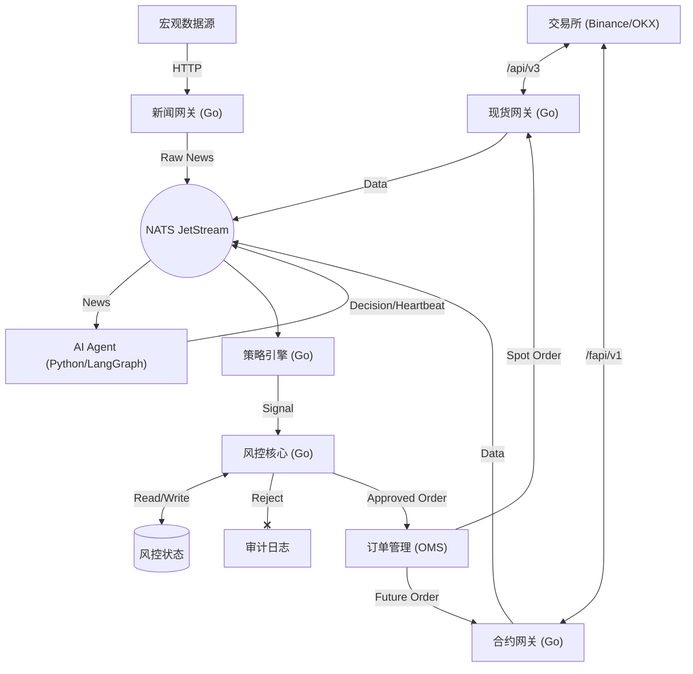

# Alpha-Trade 核心开发手册 (Core Development Manual)

**版本**: v1.1
**更新时间**: 2025-12-22
**定位**: 本文档是系统的**唯一架构真理来源**，涵盖架构设计、领域模型定义及工程规范。

---

## 1. 架构设计 (System Architecture)

系统采用 **模块化单体 (Modular Monolith)** 架构，并结合 **AI 决策侧边服务**。

### 1.1 核心分层与数据流



### 1.2 目录结构 (Monorepo)

*   `/internal`: Go 核心代码（交易、风控、OMS）。
*   `/ai-agent`: Python AI 服务（基于 LangGraph 和 Gemini 3）。
*   `/docs`: 全局文档与协议。
*   `/pkg`: 公共工具库。

### 1.3 关键组件职责

1.  **Gateway (接入层) - 原子接口与限流控制**:
    *   **Spot Gateway**: 专职现货。
    *   **Future Gateway**: 专职合约。
    *   **原子接口原则 (Atomic Interfaces)**:
        *   不进行底层自动降级。由上层逻辑明确决定调用 `PlaceOrderFast` (WS) 还是 `PlaceOrderReliable` (HTTPS)。
        *   所有接口调用必须返回精确的延迟指标与通道状态。
    *   **限流核心 (Rate Limiter Core)**:
        *   **算法选型**: 严格禁止令牌桶 (Token Bucket) 以规避交易所对突发流量 (Burst) 的 IP 封禁。强制使用 **滑动窗口 (Sliding Window)**。
        *   **多维度配额管理**: 同时监控“每秒请求数 (Req/s)”和“权重消耗 (Weight/min)”。
        *   **职责分离与真理校准**: 
            *   **Gateway 层**: 负责解析具体交易所的特定 Header 常量，并封装为标准化的 `RateLimitFeedback`。
            *   **Limiter 层**: 基于标准化数据进行决策与本地计数修正。
        *   **双通道共享**: WS 和 HTTPS 共享同一个限流器实例，确保全局合规。
        *   **等级保护**:
            *   < 80% 权重: 所有指令正常。
            *   80% - 95%: 拦截非核心查询，仅允许交易指令。
            *   > 95%: 拦截一切指令，仅允许**紧急平仓**。
    *   **News/Event Gateway (AI-Powered)**: 
        *   **多源新闻集成**: 鉴于 CryptoPanic 免费版延迟过高（24h），系统采用 **RSS 聚合 + 交易所 API + 专业媒体抓取** 的多源策略。
        *   **网页渲染与抓取 (Web Scraping)**:
            *   **方案 A: Jina Reader (当前采用)**: 通过 `r.jina.ai` 获取渲染后的 Markdown，轻量且 LLM 友好。
            *   **方案 B: 自建 V8 (Playwright) - 长期规划**: 部署 Headless 浏览器集群，用于处理极度复杂的交互逻辑（如模拟点击、反爬绕过）。
        *   **集成 Gemini 3**: 负责对抓取到的完整文本进行逻辑推演。
        *   **异步驱动架构 (MQ-Driven)**: 
            *   AI 分析结果通过 **消息队列 (MQ/EventBus)** 发送，实现 AI 层与交易层的彻底解耦。
            *   **实时反馈流**: `Multi-Source (Go GW)` -> `MQ (MARKET.NEWS)` -> `LangGraph (AI Agent)` -> `MQ (AI.DECISION)` -> `RiskManager (Go)`.
        *   **控制指令集**:
            *   **全局熔断**: 当得分极低 (e.g., < -0.9) 时，自动通过 MQ 广播 `Global_Halt` 信号，停止所有标的新开仓。
            *   **方向导向 (Directional Bias)**: 根据得分控制策略的开仓方向（仅多、仅空或双向）。
            *   **杠杆动态限制**: 极高不确定性下，MQ 驱动风控模块强制将最高杠杆降至 1x。
2.  **Logic (逻辑层)**:
    *   **Strategy**: 纯计算，关注 K 线形态与信号生成。
    *   **Risk**: **分治策略**。
        *   `SpotRules`: 重点检查余额充足率、资产分散度。
        *   `FutureRules`: 重点检查 2x 杠杆限制、逐仓模式、强平距离。
    *   **OMS**: 路由订单到对应的 Gateway，并处理订单生命周期。

### 1.3 外部事件分类 (External Events)

... (表格保持不变) ...

### 1.4 新闻源集成与质量保障

为了确保 AI 决策层获取及时且真实的数据，系统采用多源交叉验证策略，弃用高延迟的单一聚合商。

#### 1.4.1 核心来源评估

| 来源 | 实时性 | 成本 | 评估结论 |
| :--- | :--- | :--- | :--- |
| **CryptoPanic** | 🔴 24h 延迟 (免费) | $199/月 | **弃用**。免费版延迟过大，付费版限制过多，性价比极低。 |
| **RSS 自建聚合** | 🟢 实时 (<1min) | **0 元** | **主选**。直接订阅 CoinDesk, CoinTelegraph 等，无额度限制，性能极佳。 |
| **Binance API** | 🟢 实时 | 免费 | **必选**。专门监听公告、上币、维护等第一手交易所信号。 |
| **RSSHub (X/Twitter)** | 🟢 实时 (<1min) | **0 元** | **关键信号**。自建 RSSHub 监控马斯克等名人推特，捕获 Meme 币异动。 |
| **CryptoCompare** | 🟢 实时 | 免费/低配 | **备选**。聚合度高，适合作为长尾数据的补充。 |

#### 1.4.2 数据处理流 (Pipeline)
1.  **Go NewsGateway**: 并发轮询 (Polling) 多个 RSS 源（含 RSSHub 生成的推特流）及交易所公告 API。
2.  **内容清洗**: 提取 URL，初步匹配 `BTC`, `ETH` 等交易对关键字。
3.  **MQ 发送**: 将标准化消息推送到 `MARKET.NEWS`。消息包含 `url`，由 AI Agent 侧通过 `r.jina.ai` 获取正文。

#### 1.4.3 社交媒体异动监控 (High-Priority Social)
针对 Elon Musk, Vitalik Buterin 等对市场有重大影响力的账户，系统建立专用的“极速通道”：

*   **数据获取**: 使用 **RSSHub (私有化部署)** 将目标 X (Twitter) 账户转化为 RSS 流。
*   **分级处理**: 
    *   **一级账户**: (如 Musk) 触发时立即通过 AI 进行逻辑推演，不经过任何过滤器。
    *   **二级账户**: 需匹配 `Crypto`, `Binance`, `ETF` 等关键字后才激活 AI 分析。
*   **Gemini 3 角色**: 
    *   **隐喻分析**: 马斯克的推文通常含蓄，AI 需识别图片或文字背后的币种关联性（如识别“柴犬图”与 DOGE 的关联）。
    *   **反讽识别**: 过滤非交易相关的日常推文。

#### 1.4.4 宏观政策监控矩阵 (Macro Policy Constants)
系统将顶级政策源定义为底层常量，确保数据获取的路径为“最短直线”：

| 机构 | 数据类型 | 常量标识 / 接入地址 |
| :--- | :--- | :--- |
| **US White House** | RSS | `https://www.whitehouse.gov/briefing-room/feed/` |
| **US SEC (EDGAR)** | API | `https://www.sec.gov/edgar/sec-api-documentation` |
| **Federal Reserve** | API (FRED) | `https://api.stlouisfed.org/fred/` |
| **EU Central Bank** | RSS | `https://www.ecb.europa.eu/home/html/rss.en.html` |

*   **执行策略**: 
    *   **高优先级**: 以上来源触发的消息在 MQ 中标记为 `High Priority`，AI Agent 需中断常规任务优先处理。
    *   **关键词触发**: 针对宏观源，额外关注 `Interest Rate`, `Regulation`, `Crypto`, `Enforcement` 等核心词汇。

#### 1.4.5 假新闻与假账号预防
*   **来源权重**: 顶级媒体（如 Coindesk）权重为 1.0，推特/博客权重为 0.3。
*   **多源对比**: 重大事件若在 5 分钟内只有单一源报道，AI 需标记为 `Low Confidence`。
*   **域名白名单**: 严格限制 AI 爬取的域名范围。

#### 1.4.4 标准化消息格式 (JSON)
```json
{
    "id": "rss_1029384",
    "source": "CoinDesk",
    "title": "Bitcoin Surpasses $100k...",
    "text": "Snippet of the news...",
    "url": "https://www.coindesk.com/markets/...",
    "currencies": ["BTC"],
    "timestamp": 1703310000
}
```

---

## 2. 领域模型 (Domain Models)

所有核心模型定义在 `internal/domain/model`，**强制使用 `decimal`**。

### 2.1 标的与费率 (Symbol & Fee)

系统需支持多标的同时交易，且费率配置灵活。

```go
type FeeType int
const (
    FeeTypeMaker FeeType = iota
    FeeTypeTaker
)

// SymbolConfig 定义交易对的静态属性
type SymbolConfig struct {
    Name           string          // e.g., "BTCUSDT"
    BaseAsset      string          // "BTC"
    QuoteAsset     string          // "USDT"
    
    // 风险配置 (Risk Protocol Enforcement)
    MarginMode     string          // 强制 "ISOLATED"
    MaxLeverage    decimal.Decimal // 强制 <= 2.0

    // 费率配置 (优先使用 ConfiguredFee 进行回测/保守估算)
    UseCustomFee   bool            // 是否强制使用手动费率
    CustomMakerFee decimal.Decimal // 手动配置 Maker 费率 (e.g. 0.0002)
    CustomTakerFee decimal.Decimal // 手动配置 Taker 费率 (e.g. 0.0005)
    
    // 精度配置
    PricePrecision int32
    QtyPrecision   int32
    MinQty         decimal.Decimal
}

// FeeCalculator 费率计算服务
// 实盘时：优先读取 Exchange 返回的实际 Fee。
// 回测/估算时：使用 SymbolConfig 中的 CustomFee。
```

### 2.2 资金与账户 (Account & Money)

```go
// Account 聚合账户状态
type Account struct {
    Balances    map[string]decimal.Decimal // 余额表: "USDT" -> 10000.0
    Positions   map[string]*Position       // 持仓表: "BTCUSDT" -> Pos
    RiskState   *RiskState                 // 动态风控状态
    
    // 资金围栏
    AllocatedCapital decimal.Decimal       // 配置的授权资金上限 (e.g. 5000)
    InitialEquity    decimal.Decimal       // 经过 Re-baseline 的基准权益
}

// 资金变动请求
type CapitalRequest struct {
    Amount decimal.Decimal
    Type   string // "DEPOSIT" or "WITHDRAW"
}

// Position 独立仓位
type Position struct {
    Symbol       string
    Size         decimal.Decimal // 正数为多，负数为空
    EntryPrice   decimal.Decimal // 平均开仓价
    UnrealizedPnL decimal.Decimal // 未实现盈亏 (需包含预估手续费)
}
```

### 2.3 盈亏模型与结算 (PnL & Settlement)

系统采用 **FIFO (先进先出)** 原则进行持仓管理和盈亏结算，以确保回测与实盘的精确一致。

#### 2.3.1 双轨盈亏 (Dual PnL)
1.  **Estimated PnL (风控/预估用)**:
    *   使用 `SymbolConfig` 中的配置费率 (e.g. Maker 0.05%)。
    *   用途: 下单前计算预期收益、风险敞口。
2.  **Realized PnL (账务/报表用)**:
    *   使用交易所返回的 **真实 Fee**。
    *   用途: 每次平仓成交后生成结算单，计入账户净值。

#### 2.3.2 FIFO 结算队列
为了计算准确的持有时长和收益归因，`Position` 内部维护一个买入队列 (`Legs`)。

*   **开仓 (Buy/Long)**: 新生成一个 `PositionLeg` (EntryPrice, Qty, Time) 入队。
*   **平仓 (Sell/Short)**:
    *   从队列头部取出最早的 `Leg`。
    *   若平仓数量 < Leg数量: 部分结算，更新 Leg 剩余数量。
    *   若平仓数量 >= Leg数量: 完全结算该 Leg，计算该部分的持有时间 (`CloseTime - OpenTime`)，并继续处理下一条 Leg。
    *   **生成 `Settlement` 记录**: 包含 `RealizedPnL`, `Duration`, `ROI`。

---

## 3. 核心开发规范

### 3.1 精度与类型
*   **金额/价格**: 严禁 `float64`。必须使用 `github.com/shopspring/decimal`。
*   **时间**: 统一使用 `time.Time`。在回测中，**严禁**调用 `time.Now()`，必须使用 `Event.Time`。

### 3.2 多标的循环
*   Strategy 和 Risk 模块必须设计为 **Stateless (针对单次信号)** 或 **Keyed State (针对特定 Symbol)**。
*   例如，风控检查时：
    ```go
    // ❌ 错误：只检查全局
    func Check(signal) { if globalLoss > 100 ... }
    
    // ✅ 正确：区分标的和全局
    func Check(signal) {
        if globalLoss > 100 { return Block }
        if symbolLoss[signal.Symbol] > 20 { return Block }
    }
    ```

## 4. 系统可靠性与基建 (Reliability & Infrastructure)

### 4.1 NATS 部署与通信保障
*   **部署模式**: 强制 **独立进程/容器部署** (独立于交易内核)。
    *   **理由**: 物理隔离，确保交易程序崩溃时消息不丢，且磁盘 I/O 不干扰交易核心 CPU 调度。
*   **持久化引擎 (JetStream)**:
    *   启用 **JetStream** 存储流，确保 AI 指令“至少交付一次” (At-least-once delivery)。
    *   **AckExplicit**: 核心层处理完指令后必须手动 ACK。
*   **自动恢复**: 客户端启用 `MaxReconnect` (不限次) 和 `ReconnectWait`。

### 4.2 AI 决策层 Fail-safe 机制
*   **心跳监测 (Heartbeat)**: 
    *   AI 服务 (LangGraph) 每 5 秒发送一次心跳消息至 MQ。
    *   Go 核心层实时监听。
*   **安全兜底 (Safe-Default Mode)**:
    *   若 Go 核心层超过 **30 秒** 未收到 AI 心跳，自动判定 AI 决策层失联。
    *   **立即进入保护模式**: 禁止所有新开仓请求，仅允许止损与平仓操作。
    *   **警报优先级**: CRITICAL。
*   **状态校准 (Snapshot)**: 
    *   AI 每 30 秒广播一次全量风险状态快照，用于修复可能丢失的增量事件。

---

## 5. 文档索引

*   **风控协议**: 详见 [RISK_PROTOCOL.md](./RISK_PROTOCOL.md) (核心整改项)
*   **开发计划**: 详见 [ROADMAP.md](./ROADMAP.md)
*   **Phase 1 细节**: 详见 [plans/PHASE_1_DETAIL.md](./plans/PHASE_1_DETAIL.md)
