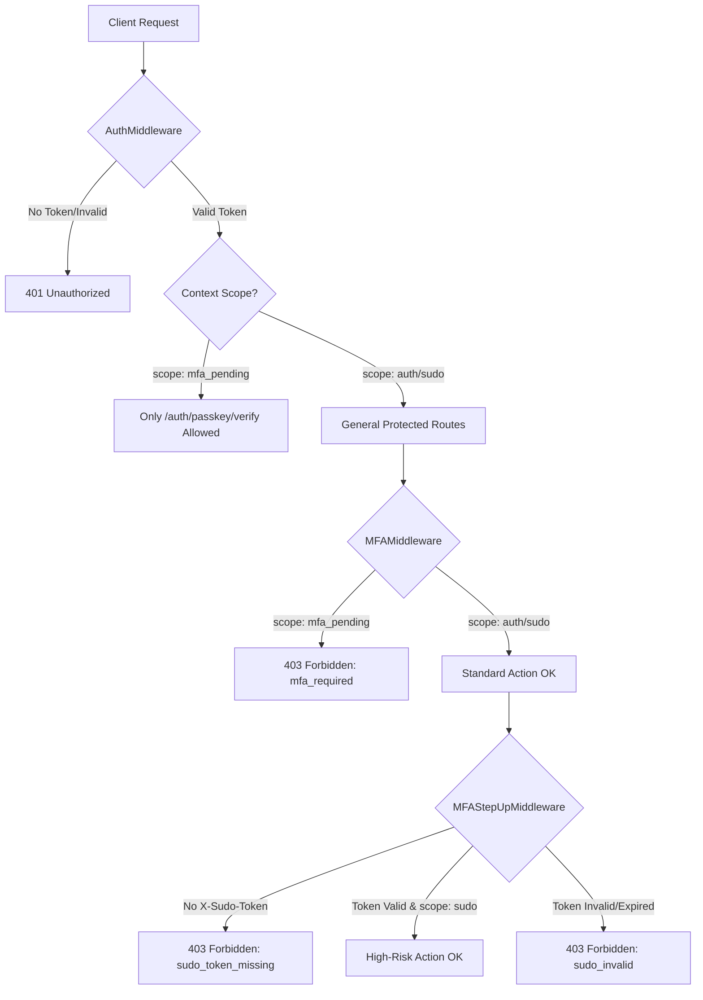

# 认证与安全协议 (Authentication & Security Protocol)

本文档说明了 Alpha-Trade 系统中三层认证中间件的设计意图与使用场景。

## 中间件层级 (Middleware Layers)

系统中定义了三种级别的安全拦截，并配合差异化的令牌有效期 (TTL)：

| 中间件 | 核心令牌 Scope | 建议 TTL | 职能与限制 |
| :--- | :--- | :--- | :--- |
| **Auth** | `mfa_pending` | 5 分钟 | **临时状态**：仅允许访问 MFA 验证接口，过期需重新登录。 |
| **MFA** | `auth` | 2 小时 | **标准状态**：已完成 2FA，可进行常规交易和资产查看。 |
| **MFAStepUp** | `sudo` | 5 分钟 | **提级状态 (Sudo)**：针对高危动作的即时授权，需携带 `X-Sudo-Token`。 |

---

## 认证流程图 (Authentication Flow)



---

## 使用示例 (go-zero .api 文件)

### 1. 基础认证 (仅需登录)
```api
@server(
    middleware: Auth
)
service auth-api {
    @handler PasskeyAddBegin
    post /add/begin (PasskeyAddBeginReq) returns (PasskeyAddBeginRes)
}
```

### 2. 需完成 2FA 的常规接口
```api
@server(
    middleware: Auth, MFA
)
service system-api {
    @handler GetSystemInfo
    get /info returns (SystemInfoRes)
}
```

### 3. 高危操作 (需提级认证)
```api
@server(
    middleware: Auth, MFA, MFAStepUp
)
service wallet-api {
    @handler Withdraw
    post /withdraw (WithdrawReq) returns (WithdrawRes)
}
```

## 关键设计决策 (Design Rationale)

- **职责分离 (SoC)**: `Auth` 只管你是谁，`MFA` 管你是否经过了二次确认，`MFAStepUp` 管你对当前高危操作是否有临时授权。
- **Fail-Fast**: 每一层中间件都会在权限不足时立即拦截，减少后端 Logic 层的负担。
- **Context 传播**: `Auth` 注入的 `uid` 贯穿后续所有中间件和 Logic 层，确保审计日志 (Audit Log) 的完整性。

